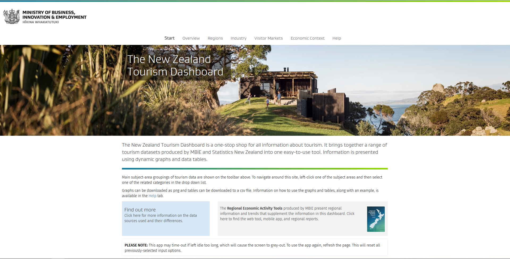
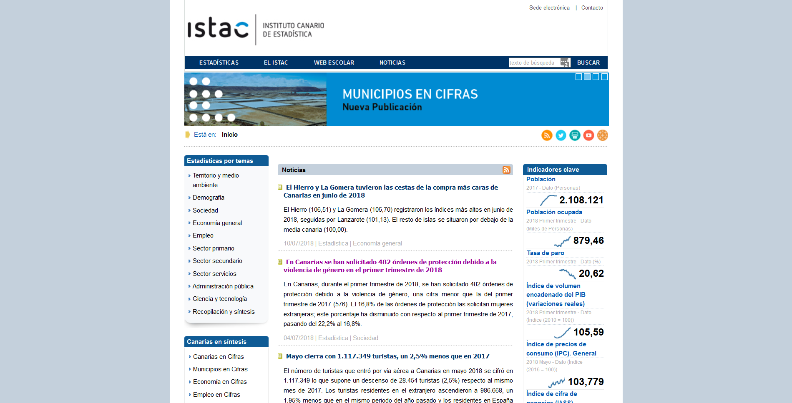
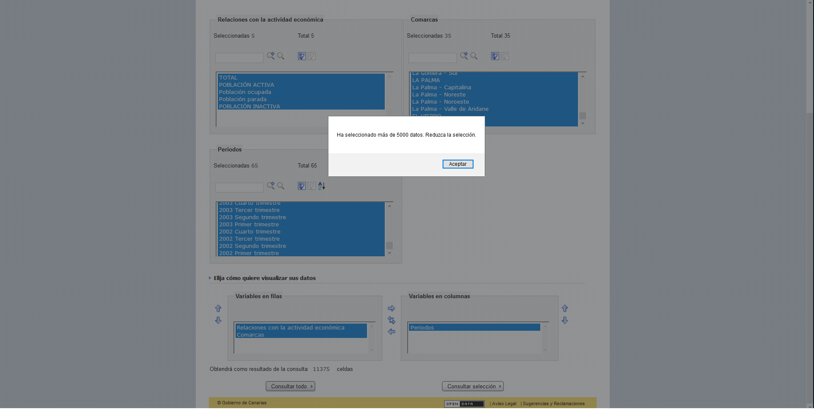
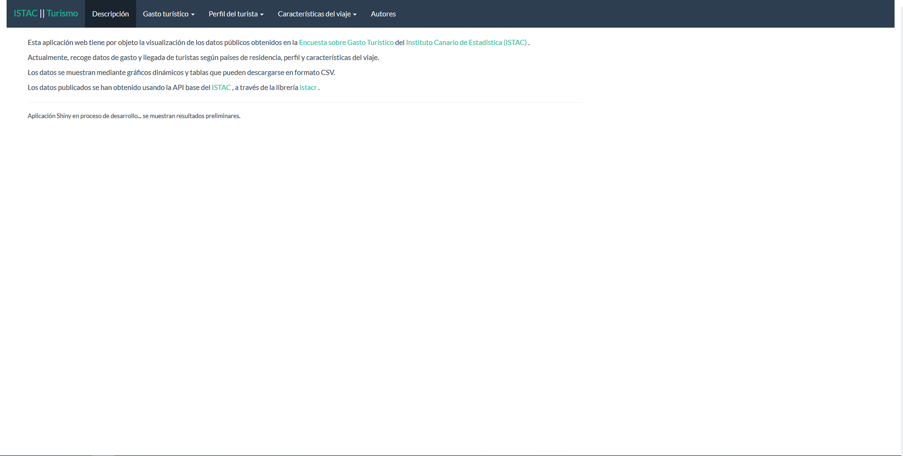
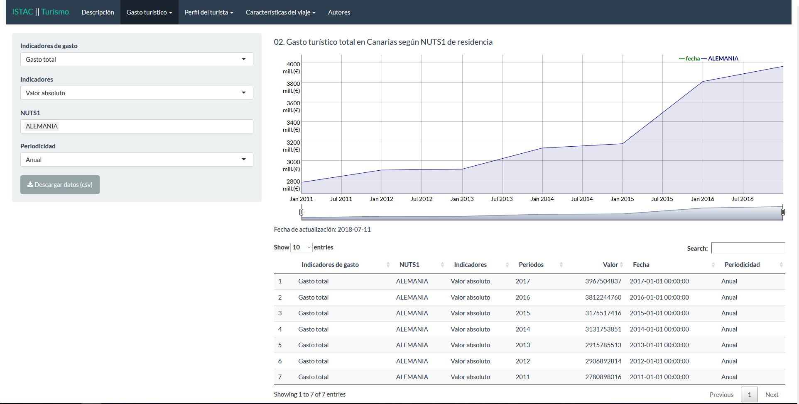
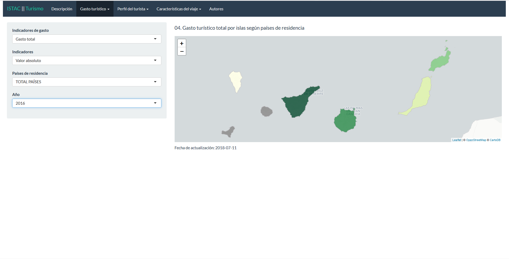

```{r setup, include=FALSE}
options(htmltools.dir.version = FALSE)
```


```{r xaringan-themer, include = FALSE}
# https://github.com/gadenbuie/xaringanthemer/blob/master/vignettes/css-help.Rmd
library(xaringanthemer)
mono_accent(
  base_color = "#43418A",
  header_font_google = google_font("Josefin Sans"),
  text_font_google   = google_font("Montserrat", "300", "300i"),
  code_font_google   = google_font("Droid Mono")
)
```


class: inverse, center, middle

# WHY THIS PROJECT?

---

# Introduction

The first aim of this project was to create a [R](https://www.r-project.org/) package that used the [ISTAC](http://www.gobiernodecanarias.org/istac/)Base's API to work with open data that this organization supply.

We realized that we can use this package with the Shiny R package to create a web page that allows users to visualize ISTAC data in a human readeable way.

Public administrations should aim at the friendly use of the data they provide.


---

# Motivation

The seed of this project comes from New Zealand. In precise it comes from the [New Zealand Tourism Dashboard](http://tourismdashboard.mbie.govt.nz/), full code available on [github](https://github.com/nz-mbie/tourism-dashboard-public), a really awesome project.



---

# Tools

* [istacr](https://github.com/rOpenSpain/istacr): R package to make programatic access to data from the  ([ISTAC](http://www.gobiernodecanarias.org/istac/)) base API.


* [Canary Islands Tourism Dashboard](https://jmcartiles.shinyapps.io/canary_islands_tourism_dashboard/): A Shiny dashboard to disseminate data and insights from the [Touristic Expenditure Survey of the ISTAC](http://www.gobiernodecanarias.org/istac/temas_estadisticos/sectorservicios/hosteleriayturismo/demanda/C00028A.html).


---


background-image: url("images/istac.png")
background-position: 85% 1%
background-size: 200px auto

# ISTAC

>  The ISTAC is the body responsible for promoting, managing and coordinating the public statistical activity of the Autonomous Community of the Canary Islands

[](http://www.gobiernodecanarias.org/istac/)

---

* Empleo
* Encuesta de población activa
* Series trimestrales. Islas y comarcas de Canarias. 2002 Primer trimestre - 2018 Primer trimestre



---

class: inverse, center, middle

# THE ISTACR PACKAGE

---
background-image: url("images/ropenspain.png")
background-position: 85% 7%
background-size: 200px auto


# ISTACR

[istacr](https://github.com/rOpenSpain/istacr) is a package to make programatic access to all datasets available using ISTACBase API. Actually this package is a contribution to the open data community [rOpenSpain](https://ropenspain.es/).


# How to use istacr?<br>Quite easy...

Here we reproduce a [guide of use](http://jmcartiles.netlify.com/post/istacr-a-quick-example-i/). 

---

# Installing the package

First it is needed to download the package from Github and load the needed packages for this example, it means, *dplyr* and *ggplot2*.


```{r comment='#', eval = FALSE}
# install and load istacr
# install.packages("devtools")
# library(devtools)
# install_github("rOpenSpain/istacr")
library(istacr)

# Load essentials package for this example
# install.packages("dplyr")
# install.packages("ggplot2")
library(dplyr)
library(ggplot2)
```


---

# Using metadata to choose the desired dataset (1)

```{r echo=FALSE}
library(istacr)
```


In this package it is included a dataframe which contain some metadata of each dataset available using the [ISTAC](http://www.gobiernodecanarias.org/istac/)Base API. It is shown using:

```{r comment="#"}
glimpse(cache)
```


---

# Using metadata to choose the desired dataset (2)

```{r}
busqueda.egt <- istac_search("paro")
```

* Regular expressions `paro|empleo`
* Using the parameter `fields`

```{r}
busqueda.egt <- istac_search("egt",
                             fields = "datos publicadosII" #<<
                             )
```

```{r, echo = FALSE}
glimpse(busqueda.egt)

```


---

The example of use is focused on showing the total tourism expenditure in Canary Islands by year and by origin country.

As in this example the objective is to get data of tourism expenditure. It is a chance to look for the string *“egt”* in the metadata and generate a subset with all datasets where that string is found. In this case the field (variable) should be *“datos publicadosII”*.

--

When a subset of metadata is get, it is the momment to see the desired *“ID”*, in our case it is:

```{r}
busqueda.egt$ID[1]
```

---

# Downloading data from [ISTAC](http://www.gobiernodecanarias.org/istac/)

--

In one line the full dataset it is ready to use:

```{r}
df <- istac(busqueda.egt$ID[1], POSIXct = TRUE, freq = "anual")
```

--

The next step to show total expenditure, data must be filter the data as follow:

```{r}
df.anual <- filter(df,
                   nchar(Periodos) == 4 &
                     Indicadores == "Valor absoluto" &
                     `Indicadores de gasto` == "GASTO TOTAL" &
                     `Países de residencia` != "TOTAL PAÍSES")
```


---

# Plot data using ggplot

--

Finally, using *ggplot* the year evolution of total expenditure is:

```{r, eval=FALSE, echo=TRUE}
ggplot(df.anual,
       aes(x = Periodos,
           y = valor,
           fill = `Países de residencia`)) +
  geom_col(position = "dodge") +
  xlab("") +
  ylab("") +
  theme(
    panel.background = element_blank(),
    axis.ticks = element_blank()
  )
```

---

class: center

```{r, echo=FALSE}
ggplot(df.anual, aes(x = Periodos, y = valor,
                     fill = `Países de residencia`)) +
  geom_col(position = "dodge") +
  xlab("") +
  ylab("") +
  theme(
    panel.background = element_blank(),
    axis.ticks = element_blank()
  )
```

---

class: inverse, middle, center

# STEP 2: DATA VISUALIZATION
# The Canary Islands Tourism Dashboard

---


--
Actually, tourism is the main sector in the economic development in Canary Islands, representing the [34.3% GDP and 39.7% employment in this region in 2016 (IMPACTUR, 2016)](http://www.exceltur.org/wp-content/uploads/2017/09/IMPACTUR-Canarias-2016.pdf).

This means that it is necessary to increase the knowledgement of this sector and disseminate information obtained with population in general and decision-makers in concrete.

---


# Creating a Shiny Web Application

This application is feed up using the ISTAC base API through istacr and its main purposes are the access to ISTAC tourism data and to facilitate the understanding of tourism patterns in the Canary Islands with special attention to exploit the statistics which comes from Touristic Expenditure Survey.



---

The structure of this Shiny shows a dashboard with main results and several slides describing different data. It is available to filter data and change the rendered visualization. It has an option to download data.




---



---
# Conclusions

A combination of, by one side open data provided by [ISTAC](http://www.gobiernodecanarias.org/istac/), and by the other side, different tools and programming languages such as [Github](https://github.com/) and [R](https://www.r-project.org/), let us to concrete these ideas in a tourism dashboard with open data, open code and free use.

---

class: inverse, middle, center

# THANKS!

---


